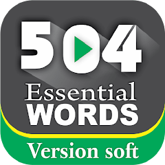
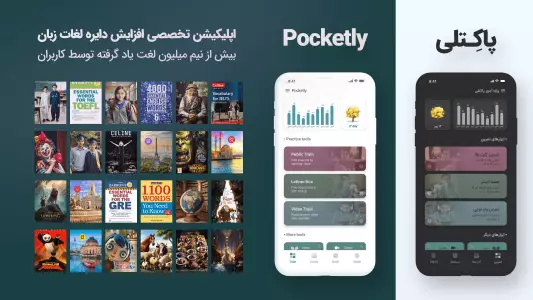
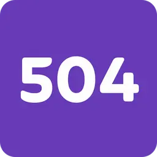
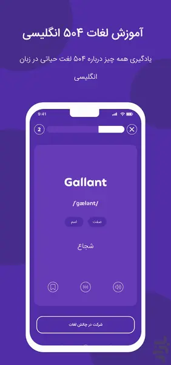
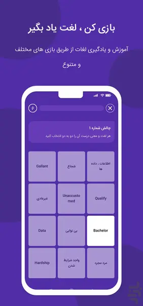

# [504](504-Essential-Words-Flashcards/README.md)

This app provides pronunciation, example **sentences**, and multiple meanings for each word. It includes **images**, a built-in dictionary, and interactive exercises where after studying a word, users listen to its audio, spell it correctly, and record themselves to practice pronunciation.

## Features

| Feature | Available |
|---------|-----------|
| Pronunciation for each word | ✅ |
| Example sentences | ✅ |
| Multiple meanings | ✅ |
| Images for words | ✅ |
| Audio playback & spelling exercises | ✅ |
| Record and practice pronunciation | ✅ |
| Built-in dictionary | ✅ |

##

# [504 Essential Words: English](504-Essential-words-English/README.md)

This app supports four languages: **Turkish**, **Arabic**, **English**, and **Persian**. For each word, it provides a video demonstrating pronunciation, usage, and example sentences. Each chapter includes quizzes to test learning.

## Features

| Feature | Available |
|---------|-----------|
| Supports Turkish, Arabic, English & Persian | ✅ |
| Video showing word pronunciation & usage | ✅ |
| Example sentences | ✅ |
| Quizzes for each chapter | ✅ |

##

# [504 Essential Words + Videos](504-Essential-words-green-logo/README.md)

This app includes **42 lessons**, **with 12 words** in each lesson. After completing every lesson, users can take a quiz for that specific lesson to test their knowledge.
The app also contains stories that use 504 words in context, helping learners understand their real usage.
In addition, there is a **dictionary** section that provides the correct pronunciation, meaning, and explanation of each word. For every word, three example sentences are included.
The app does not include a **Leitner** (spaced repetition) system.

## Features

| Feature | Available |
|---------|-----------|
| Quiz | ✅ |
| Stories using 504 words | ✅ |
| Dictionary section | ✅ |
| Correct pronunciation | ✅ |
| Meaning & explanation | ✅ |
| Leitner system | ❌ |

##

  
  
  
  

##

# [Pocketly](Pocketly/README.md)

This app includes a *Leitner* (spaced repetition) system to help users memorize words effectively. It offers various word sets such as **504**, **4000**, **1100**, and more.
The app is limited in the free version, and users need to purchase a subscription to unlock full access.
For each word, the app provides the **meaning**, detailed **description**, concept explanation, synonyms, antonyms, proverbs, and additional related information.
With the help of the **Leitner** system, users can review and learn words more efficiently.
The app also includes audio pronunciation for words and supports more than **10 languages**.

## Features

| Feature | Available |
|---------|-----------|
| Leitner (spaced repetition) system | ✅ |
| Multiple word lists (504, 4000, 1100, etc.) | ✅ |
| Free version with limitations | ✅ |
| Subscription required for full access | ✅ |
| Word meaning & explanation | ✅ |
| Concept & description | ✅ |
| Synonyms & antonyms | ✅ |
| Proverbs & related content | ✅ |
| Audio pronunciation | ✅ |
| Supports 10+ languages | ✅ |

##

  
  
  
  

##

# [Application 504](Application-504/README.md)

This app includes a daily progress table that shows how many words you have learned so far.
For each word, the app provides the meaning, correct pronunciation, and one example sentence.
After studying the words, users must take a test, which is designed in three stages to better evaluate learning.

## Features

| Feature | Available |
|---------|-----------|
| Daily progress table | ✅ |
| Shows number of learned words | ✅ |
| Word meaning | ✅ |
| Correct pronunciation | ✅ |
| Example sentence (1 per word) | ✅ |
| Test after learning words | ✅ |
| Three-stage test | ✅ |

##

  
  
  

##

# **Comparison table**

| **Feature / App** | **[Learning English](Learning-English/README.md)** | **[504 Essential words](English-504-Essential-words-f/README.md)** | **[504](504-Essential-Words-Flashcards/README.md)** | **504 Essential Words: English** | **504 Essential Words + Videos** | **Pocketly**| **Application 504** |
|-------------------|------------------------------------------|-----------------------------------------|----------------------------------|-------------|---------------------|-----------------------------------------------|---------------------------------------------------------|
| **Word pronunciation** | ✅ | ✅ | ✅ | ✅ | ✅ | ✅ | ✅ |
| **Meaning (definitions)** | ✅ | ✅ | ✅ | ✅ | ✅ | ✅ | ✅ |
| **Example sentences** | ✅ | ✅ | ✅ | ✅ | ✅ | ✅ | ✅ |
| **Quizzes / Tests** | ✅ | ✅ | ✅ | ✅ | ✅ | ✅ | ✅ |
| **Images for vocabulary** | ❌  | ❌  | ✅ | ❌ | ❌ | ❌ | ❌ |  
| **Built-in dictionary** | ❌  | ✅ | ✅ | ❌ | ✅ | ❌ | ❌ | 
| **Stories with 504 words** | ❌  | ✅ | ❌  | ❌  | ✅ | ❌ | ❌ | 
| **Multiple meanings** | ❌  | ❌  | ✅ | ❌  | ✅ | ✅ | ❌ |
| **Record pronunciation** | ❌  | ❌  | ✅ | ❌ | ❌ | ❌ | ❌ |
| **Supports multiple languages (UI / translations)** | ✅ | ✅ | ✅ | ✅ | ❌ | ✅ | ❌ | 
| **Video showing pronunciation / usage** | ❌  | ❌  | ❌ | ✅ | ❌ | ❌ | ❌ |
| **Leitner system** | ❌ | ❌ | ❌ | ❌ | ❌ | ✅ | ❌ |

