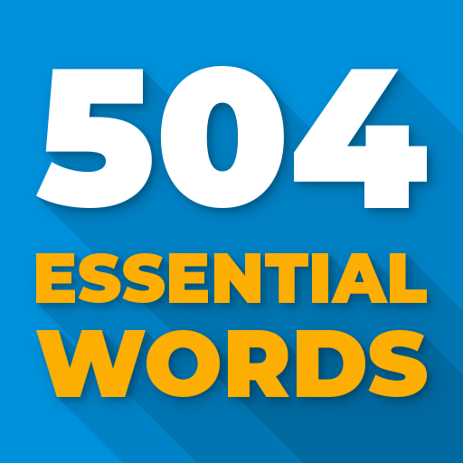

# [Learning English](Learning-English/README.md)

Learn the 504 essential English words efficiently with **Learning English**. This app includes **42 lessons**, each containing **12 words**.

## Features

| Feature | Available |
|---------|-----------|
| Pronunciation & meaning | ✅ |
| Example sentences | ✅ |
| 100+ quizzes | ✅ |
| Images, review & ad-free (premium) | ✅ |
| Supports Persian & English | ✅ |
| Weekly learning stats | ✅ |

 
## 

# [504 Essential words](English-504-Essential-words-f/README.md)

This app covers all **504 English words** in **42** chapters, each containing **12 words**. It provides correct pronunciation, example **sentences**, and a built-in **dictionary**. The app includes stories using 504 words and offers quizzes for each chapter to reinforce learning.

## Features

| Feature | Available |
|---------|-----------|
| 42 Chapters with 12 words each | ✅ |
| Example sentences for each word | ✅ |
| Correct pronunciation | ✅ |
| Correct pronunciation | ✅ |
| Stories using 504 words | ✅ |
| Quizzes for each chapter | ✅ |
| Built-in dictionary | ✅ |

##

# [504](504-Essential-Words-Flashcards/README.md)

This app provides pronunciation, example **sentences**, and multiple meanings for each word. It includes **images**, a built-in dictionary, and interactive exercises where after studying a word, users listen to its audio, spell it correctly, and record themselves to practice pronunciation.

## Features

| Feature | Available |
|---------|-----------|
| Pronunciation for each word | ✅ |
| Example sentences | ✅ |
| Multiple meanings | ✅ |
| Images for words | ✅ |
| Audio playback & spelling exercises | ✅ |
| Record and practice pronunciation | ✅ |
| Built-in dictionary | ✅ |

##

# [504 Essential Words: English](504-Essential-words-English/README.md)

This app supports four languages: **Turkish**, **Arabic**, **English**, and **Persian**. For each word, it provides a video demonstrating pronunciation, usage, and example sentences. Each chapter includes quizzes to test learning.

## Features

| Feature | Available |
|---------|-----------|
| Supports Turkish, Arabic, English & Persian | ✅ |
| Video showing word pronunciation & usage | ✅ |
| Example sentences | ✅ |
| Quizzes for each chapter | ✅ |

##

# **Comparison table**

| **Feature / App** | **Learning English** | **504 Essential Words** | **504** | **504 Essential Words: English** |
|-------------------|------------------------------------------|-----------------------------------------|-----------------------------------------------|---------------------------------------------------------|
| **Word pronunciation** | ✓ Yes | ✓ Yes | ✓ Yes | ✓ Yes |
| **Meaning (definitions)** | ✓ Yes | ✓ Yes | ✓ Yes | ✓ Yes |
| **Example sentences** | ✓ Yes | ✓ Yes | ✓ Yes | ✓ Yes |
| **Quizzes / Tests** | ✓ Yes | ✓ Yes | ✓ Yes | ✓ Yes |
| **Images for vocabulary** | ❌ No | ❌ No | ✓ Yes | ❌ No |
| **Built-in dictionary** | ❌ No | ✓ Yes | ✓ Yes | ❌ No |
| **Stories with 504 words** | ❌ No | ✓ Yes | ❌ No | ❌ No |

